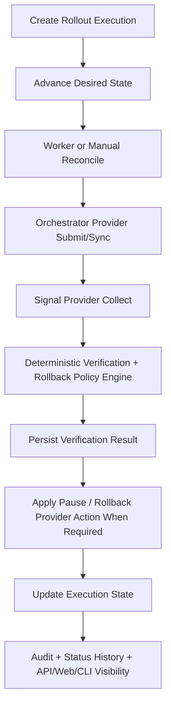

# Live Runtime Integration

Change Control Plane now supports a real closed-loop runtime path for rollout executions.

The current live path is intentionally deterministic and safety-first:

1. A rollout execution is created with a backend type and signal provider type.
2. A machine actor or human operator advances desired state.
3. The worker or a manual reconcile request claims the execution.
4. The reconciler submits or syncs the execution against an orchestrator provider.
5. Runtime signal snapshots are collected or ingested through a normalized provider boundary.
6. The verification engine evaluates backend state plus signal health.
7. Automated decisions are persisted, explainable, and audited.
8. The rollout detail API, CLI, and web console expose the resulting timeline.

## Current Live Backends

- `simulated`: live and verified for local development, CI, and persisted smoke tests.
- `kubernetes`: near-real HTTP-backed provider with real status sync, pause/resume, and rollback action paths against Kubernetes-style endpoints. It is not yet `client-go`-based or cluster-proven in this repository.

## Current Signal Providers

- `simulated`: live and verified. Reads normalized snapshots that were ingested through the control-plane API.
- `prometheus`: near-real HTTP-backed provider. Collects normalized signal snapshots through `query_range` requests during reconcile.

## External Proof Modes

The repository now distinguishes three proof classes for external integrations and runtime environments:

- `hosted_like`: realistic harness or proxied validation that exercises the production code paths without claiming a real customer or hosted-environment capture
- `customer_environment`: an operator-run proof against customer-owned Kubernetes, Prometheus, or SCM infrastructure
- `hosted_saas`: an operator-run proof against real hosted SaaS endpoints such as GitHub Cloud or GitLab SaaS

The `cmd/live-proof-verify` runner writes a report that records the declared environment class, secret-safe config summary, proof checks, warnings, and evidence summary. This strengthens operator trust, but it does not mean the repository itself has already executed those real external environments.

## Execution Flow

## Safety Principles

- Desired state and backend state are stored separately on the rollout execution record.
- Automated decisions never rely on opaque model output.
- Signal snapshots are persisted so decisions can be reconstructed later.
- Automated actions run as explicit actors and are visible in the audit trail.
- Manual overrides remain possible, but they still pass through RBAC and audit boundaries.
