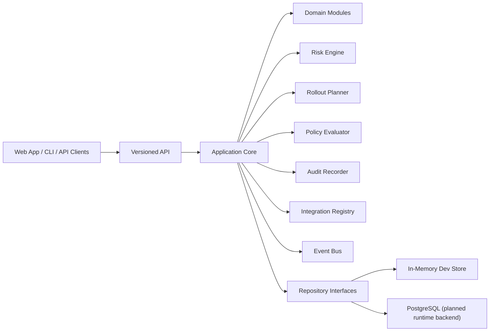

# Architecture Overview

## Summary

ChangeControlPlane starts as a modular monolith with strong seams for later extraction. The architecture is deliberately domain-oriented, event-aware, and API-first.

## Why This Shape

- it avoids premature microservice sprawl
- it keeps boundaries explicit and extraction-ready
- it supports high-cohesion domain modules
- it lets us move quickly while keeping enterprise-grade seams

## Primary Runtime Components

- API service for control-plane operations
- worker service for asynchronous and long-running workloads
- CLI for automation, scripting, and operator workflows
- web application for operational visibility and governance UX
- PostgreSQL-first schema and migrations
- pluggable event bus and integration adapters

## Domain Modules

The repository is organized around major product capabilities:

- org, project, team, and user administration
- service catalog and environment modeling
- change ingestion and assessment
- risk and rollout planning
- policies and audit
- integrations and eventing
- incident, simulation, and AI-ready extension points
