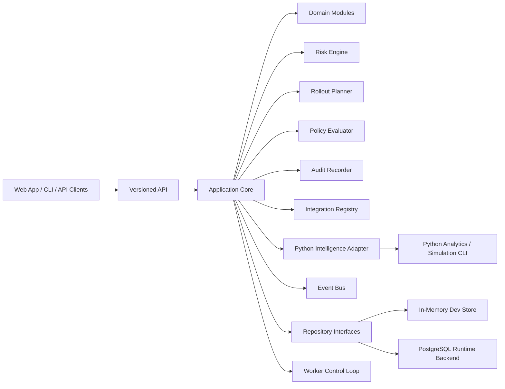

# Architecture Overview

## Summary

ChangeControlPlane starts as a modular monolith with strong seams for later extraction. The architecture is deliberately domain-oriented, event-aware, and API-first.

## Why This Shape

- it avoids premature microservice sprawl
- it keeps boundaries explicit and extraction-ready
- it supports high-cohesion domain modules
- it lets us move quickly while keeping enterprise-grade seams

## Primary Runtime Components

- API service for control-plane operations
- worker service for authenticated rollout reconciliation and long-running workloads
- CLI for automation, scripting, and operator workflows
- web application for operational visibility and governance UX
- PostgreSQL-first schema and migrations
- pluggable event bus and integration adapters
- Python intelligence subprocess for supplemental analytics and simulation

## Runtime Truths

- PostgreSQL is the default runtime store; the in-memory store remains for tests and lightweight local fallback.
- The worker is no longer a heartbeat stub. It authenticates as a machine actor and advances rollout executions through safe automatic transitions such as `planned -> in_progress` and `verified -> completed`.
- Python is now a real subsystem. The Go application invokes it for supplemental risk augmentation and rollout simulation, then persists the structured outputs into risk-assessment and rollout-plan metadata.
- The in-process event bus is still the only operational event transport. NATS is configured but not wired yet.

## Domain Modules

The repository is organized around major product capabilities:

- org, project, team, and user administration
- service catalog and environment modeling
- change ingestion and assessment
- risk and rollout planning
- policies and audit
- integrations and eventing
- incident, simulation, and AI-ready extension points
